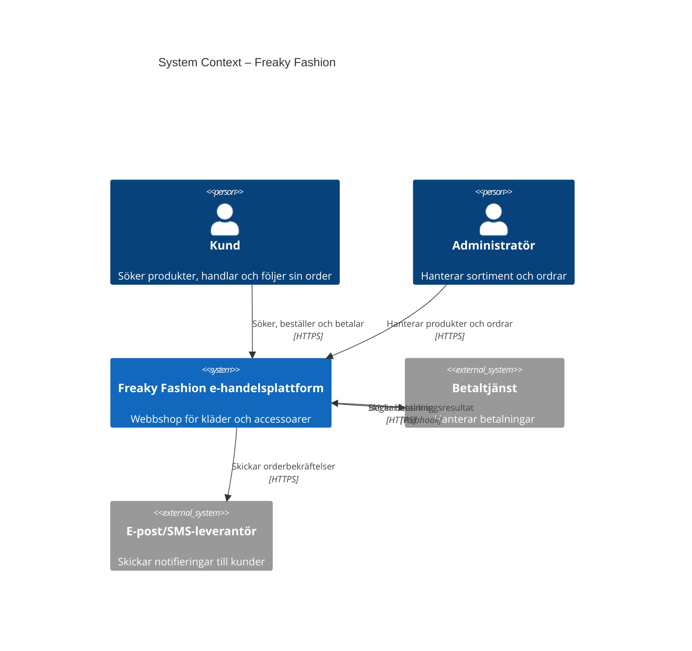

# System Context Diagram

Visar Freaky Fashion, dess användare och externa system.

```mermaid
C4Context
  title System Context – Freaky Fashion

  Person(kund, "Kund", "Söker produkter, handlar och följer sin order")
  Person(admin, "Administratör", "Hanterar sortiment och ordrar")

  System(ff, "Freaky Fashion e-handelsplattform", "Webbshop för kläder och accessoarer")

  System_Ext(betal, "Betaltjänst", "Hanterar betalningar")
  System_Ext(epost, "E-post/SMS-leverantör", "Skickar notifieringar till kunder")

  Rel(kund, ff, "Söker, beställer och betalar", "HTTPS")
  Rel(admin, ff, "Hanterar produkter och ordrar", "HTTPS")
  Rel(ff, betal, "Begär betalning", "HTTPS")
  Rel(betal, ff, "Skickar betalningsresultat", "Webhook")
  Rel(ff, epost, "Skickar orderbekräftelser", "HTTPS")
```

